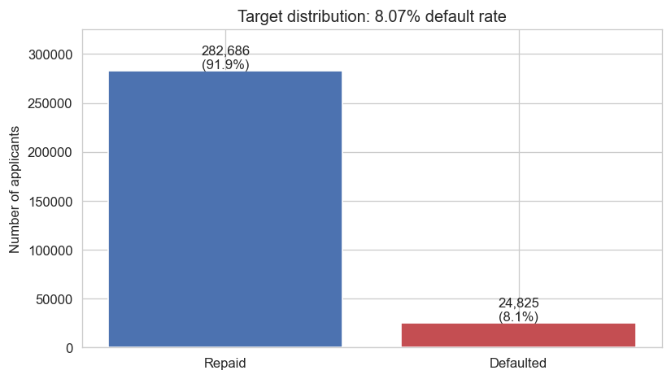
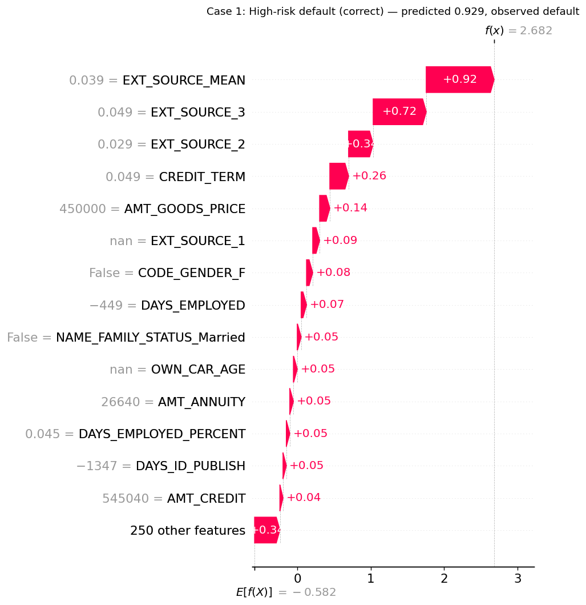

# Credit Default Prediction — Home Credit Default Risk

End-to-end credit scoring model on the Home Credit Default Risk dataset, built as a portfolio project demonstrating the full workflow a credit analytics team uses in practice: exploratory analysis, defensible feature engineering, model development with bounded hyperparameter tuning, business-aware evaluation, and interpretability.

> **Author:** Jeffrey Larbi-Akor — Microsoft Certified Data Scientist with 4+ years across data analytics, ML, and large-scale data quality operations across fintech and telecoms in Africa.
> Built as a portfolio piece focused on credit-eligibility and lending analytics roles in African fintech.

---

## Business problem

Lenders face an asymmetric risk: approving an applicant who defaults costs more than declining one who would have repaid. The job of a credit scoring model is to **rank applicants by default probability** so the lender can set an approval threshold that balances portfolio growth against loss provisioning.

This project builds and evaluates such a ranking model on the publicly available Home Credit Default Risk dataset, using the metric choices, validation protocol, and operating-point framing a working credit team would actually use.

## Dataset

[Home Credit Default Risk](https://www.kaggle.com/competitions/home-credit-default-risk) — 307,511 loan applications with 122 features (demographics, income, credit history flags, external risk scores) and a binary `TARGET` indicating whether the loan went into default.

**Class imbalance:** 8.07% of applications default. This single number drives every modelling and evaluation choice below.



### Scope of v1: main application table only

This v1 uses only `application_train.csv`. The competition also provides six auxiliary tables (`bureau`, `previous_application`, `credit_card_balance`, `installments_payments`, `POS_CASH_balance`, `bureau_balance`) that capture each applicant's prior credit behaviour. Those tables are known to lift performance materially in published solutions — but I've deliberately deferred them to keep v1 shippable in a 1-2 day window. Adding them is the single highest-impact next step. See **Limitations** below.

---

## Approach

| Stage | Notebook | What it does |
|---|---|---|
| Exploration | [`01_eda.ipynb`](notebooks/01_eda.ipynb) | Class imbalance, missingness, EXT_SOURCE separation, demographic stratification, anomaly detection |
| Feature engineering | [`02_feature_engineering.ipynb`](notebooks/02_feature_engineering.ipynb) | Sentinel cleaning, derived ratios, EXT_SOURCE aggregation, one-hot encoding, train/test alignment |
| Modelling | [`03_modeling.ipynb`](notebooks/03_modeling.ipynb) | Logistic regression baseline + LightGBM (tuned and untuned) with stratified 5-fold CV |
| Evaluation | [`04_evaluation.ipynb`](notebooks/04_evaluation.ipynb) | ROC-AUC, PR-AUC, KS, calibration, threshold analysis |
| Interpretation | [`05_interpretation.ipynb`](notebooks/05_interpretation.ipynb) | SHAP global importance and individual case explanations |

### Why these two models

Logistic regression is the **regulated-lending baseline** — interpretable, auditable, slow to drift. LightGBM is the **gradient boosting model that dominates credit scoring** in production deployments — it handles missing values natively, scales to the dataset size, and produces the lift that justifies the interpretability overhead via SHAP.

Reporting both lets us quantify the cost of interpretability: how much ranking performance do you trade away by sticking with LR? This project answers that with a concrete number.

### Class imbalance handling

- **LR:** `class_weight="balanced"` (sklearn re-weights the loss by inverse class frequency)
- **LightGBM:** `scale_pos_weight=11.4` (the inverse of the positive class rate)
- **CV:** stratified 5-fold so each fold preserves the 8.07% positive rate
- **Metrics:** PR-AUC and KS prioritised over ROC-AUC and accuracy (the latter being meaningless on imbalanced data)

### Hyperparameter tuning budget

Optuna search on LightGBM, bounded at **40 trials OR 30 minutes wallclock, whichever comes first**. The search hit the timeout at 33 trials. Bounded tuning is documented deliberately — a portfolio repo claiming "I tuned the model with Optuna" needs to back that with a real but proportionate search, not a Kaggle-grade 500-trial sweep that overfits the validation folds.

---

## Headline results

### CV performance (5-fold stratified, out-of-fold)

| Model | ROC-AUC | PR-AUC | KS | Std (ROC-AUC) |
|---|---:|---:|---:|---:|
| Logistic Regression | 0.7500 | 0.2279 | 0.372 | 0.0051 |
| LightGBM (untuned) | 0.7670 | 0.2510 | 0.399 | 0.0046 |
| **LightGBM (tuned)** | **0.7692** | **0.2536** | **0.402** | **0.0042** |


### Key numbers in plain language

- **KS = 0.40** for the tuned model — sits right at the *acceptable → strong* boundary in retail credit scoring (industry rule of thumb: ≥ 0.40 is strong, 0.30–0.40 is acceptable). Achieving this on application-table-only features, without bureau aggregations, is a meaningful result.
- **PR-AUC = 0.254 against a base rate of 0.0807** — roughly **3.15× lift** over random ranking at the precision-recall trade-off.
- **LightGBM vs LR gap: +0.019 ROC-AUC** — quantifies the cost of switching from an interpretable linear model to gradient boosting.
- **Tuning lift over untuned LightGBM: +0.002 ROC-AUC** — small but real, reported honestly. The default hyperparameters were already strong on this dataset.

### Operating point: top-decile threshold

| Metric | Value |
|---|---|
| Threshold | 0.705 |
| Applicants flagged | 10.0% |
| Within-flagged default rate | 27.77% |
| Lift over base rate (8.07%) | 3.4× |
| Defaulters captured | 34.4% |

**In plain language:** if the model were deployed to flag the 10% riskiest applicants for manual review or decline, it would catch roughly **a third of all defaulters** in that 10%, and the flagged group would have a default rate **3.4× the population baseline**. (See **Important caveats** below — this is descriptive of the historical observed distribution, not a counterfactual claim about approving more applicants.)

---

## What the model learned

SHAP TreeExplainer values on a stratified 10,000-row sample.


### Top 5 features by mean |SHAP|

| Rank | Feature | Mean \|SHAP\| | Type |
|---|---|---:|---|
| 1 | `EXT_SOURCE_MEAN` | 0.381 | **Engineered** |
| 2 | `CREDIT_TERM` | 0.187 | **Engineered** |
| 3 | `EXT_SOURCE_3` | 0.178 | Raw |
| 4 | `AMT_GOODS_PRICE` | 0.138 | Raw |
| 5 | `EXT_SOURCE_2` | 0.114 | Raw |

**Two of the top three features are engineered, not raw.** `EXT_SOURCE_MEAN` (the mean of available external risk scores per applicant) does roughly **2× more work** than any other feature in the model — including each of the individual external scores it was derived from. `CREDIT_TERM` (annuity / credit, an implied-loan-term proxy) ranks ahead of two of the three raw external scores. The aggregation and ratio features earned their place.

### What the model is doing, in plain English

- **External credit scores dominate.** The three `EXT_SOURCE_*` columns plus the derived `EXT_SOURCE_MEAN` account for four of the top six SHAP features. Where bureau scores are consistent and low, the model is confident about default risk.
- **Loan size relative to capacity matters.** `CREDIT_TERM`, `AMT_GOODS_PRICE`, `AMT_ANNUITY`, `AMT_CREDIT` — the model uses these in combination rather than applying a single DTI cutoff.
- **Demographic stability is a secondary signal.** `DAYS_BIRTH` (age), `DAYS_EMPLOYED`, `DAYS_ID_PUBLISH`, `DAYS_LAST_PHONE_CHANGE` — older, longer-employed, longer-tenured applicants are flagged as lower risk.

### Individual case explanations

The interpretation notebook also includes SHAP waterfall plots for three deliberately chosen cases: a confidently-correct high-risk case (predicted 0.929, defaulted), a confidently-correct low-risk case (predicted 0.019, repaid), and a borderline false positive (predicted 0.705, repaid). The borderline case is the most interesting — it shows what features pushed the prediction above the threshold for an applicant who did not in fact default. This is the audit trail a credit team would use when challenged on a specific decline decision.



---

## Important caveats

These are deliberately prominent rather than buried. A credit model without honest limitations is not a serious artifact.

### No reject inference

The dataset contains outcomes only for applicants who were approved. Any claim about "approving X% more applicants while holding default rate constant" requires reject inference — modelling outcomes for the declined applicants we never observed. This is genuinely out of scope for application-table-only modelling, and would require either external data or assumptions about the decline population. All operating-point statements above are scoped to the observed historical distribution.

### Calibration is uncorrected

The model is well-suited for **ranking** (high ROC-AUC, high KS) but its predicted probabilities are inflated by `scale_pos_weight`. The probabilities should not be used directly for loss provisioning (expected loss = PD × LGD × EAD). A post-hoc isotonic or sigmoid calibration step on a held-out set would correct this — a v2 task.

### Fairness audit not performed

SHAP reveals `CODE_GENDER_F` as the #9 feature by mean |SHAP|. The model is using gender to make decisions. In most jurisdictions gender is a protected attribute for credit decisions; production deployment would require either dropping it, formal disparate impact analysis, or both. This was not performed in v1 and is named here as a v2 priority.

### No time-based validation split

Cross-validation folds are random, not chronological. A production model should be validated on a held-out time period after the training window — defaults exhibit time-varying patterns (macroeconomic regime, seasonality) that random folds don't expose.

### Auxiliary tables not used

The biggest single source of additional lift on this dataset is feature engineering on the six auxiliary tables (`bureau`, `previous_application`, etc.). Published top-of-leaderboard solutions get 30-50% of their lift from these. v1 deliberately excludes them.

### Bounded hyperparameter search

Optuna ran for 33 trials in 30 minutes. A production model would justify a much larger budget, multi-seed evaluation, and a held-out test split rather than only out-of-fold predictions.

---

## What I'd do next (v2 priorities)

In rough order of expected impact:

1. **Join the auxiliary tables.** Aggregate `bureau` credit-line statistics, `previous_application` flags, and `installments_payments` behaviour into applicant-level features. Expected lift: 0.02–0.04 ROC-AUC based on published Home Credit work. This is the highest-impact single change available.
2. **Reject inference.** Apply parcelling or augmentation to estimate outcomes for declined applicants, then re-fit. This would unlock honest "approve X% more" framing.
3. **Calibration.** Fit an isotonic regression on a held-out set so the model's predicted probabilities can be used directly for expected-loss calculations.
4. **Fairness audit.** Stratify performance metrics by `CODE_GENDER` and the other potentially protected attributes. Decide whether to drop gender as a feature or retain with formal disparate impact testing.
5. **Time-based holdout.** Replace random k-fold with a chronological split if any time information is available in the application data.
6. **Threshold optimisation by cost function.** Move from "top-decile" to a threshold derived from explicit estimates of FP cost (declined good applicant) vs FN cost (approved defaulter).

---

## Repository structure

```
.
├── README.md                       # You are here
├── LICENSE                         # MIT
├── requirements.txt                # Pinned dependencies
├── data/
│   ├── raw/                        # Kaggle dataset (gitignored - see data/raw/README.md)
│   └── processed/                  # Parquet feature matrices (gitignored)
├── notebooks/
│   ├── 01_eda.ipynb
│   ├── 02_feature_engineering.ipynb
│   ├── 03_modeling.ipynb
│   ├── 04_evaluation.ipynb
│   └── 05_interpretation.ipynb
├── src/                            # Importable helpers used by the notebooks
│   ├── data.py                     # Loading, missing-value summaries
│   ├── features.py                 # Cleaning, derived features, encoding, alignment
│   └── evaluation.py               # ROC, PR, KS, calibration, threshold sweep
├── models/
│   ├── lightgbm_final.txt          # Trained model (gitignored)
│   └── lightgbm_metadata.json      # Best params, CV scores, feature columns
└── reports/
    └── figures/                    # PNGs from notebooks
```

## Setup

```bash
git clone https://github.com/jeffreylarbiakor/credit-default-prediction-home-credit.git
cd credit-default-prediction-home-credit
python3.12 -m venv .venv && source .venv/bin/activate
pip install --upgrade pip
pip install -r requirements.txt
```

On macOS, LightGBM additionally requires OpenMP: `brew install libomp`.

Then download the dataset following [`data/raw/README.md`](data/raw/README.md).

Run notebooks in order: `01_eda` → `02_feature_engineering` → `03_modeling` → `04_evaluation` → `05_interpretation`.

## Reproducibility

- Python 3.12.13, dependencies pinned in `requirements.txt`
- Fixed random seeds (`SEED=42`) for splits, model initialisation, and the Optuna sampler
- Train-statistic-only imputation (no leakage from test medians into train)
- Scaling fitted inside the CV fold loop for the LR baseline
- LightGBM uses native NaN handling on a separate feature matrix; LR uses median-imputed inputs

## License

MIT — see [LICENSE](LICENSE).
