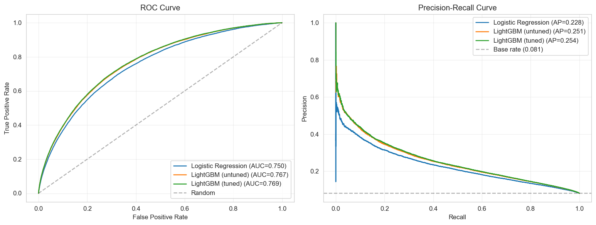
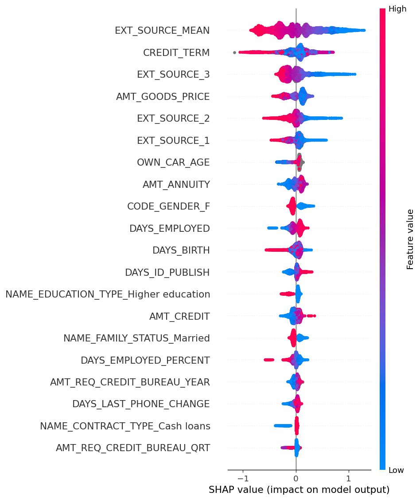

# Credit Default Prediction — Home Credit Default Risk

A binary classification model predicting probability of loan default on the Home Credit Default Risk dataset, built as a portfolio project demonstrating end-to-end credit scoring workflow: exploratory analysis, feature engineering, model development, business-aware evaluation, and interpretability.

> **Author:** Jeffrey Larbi-Akor — Data & AI professional based in Accra, Ghana.
> Built as part of an active job search focused on credit-eligibility and lending analytics roles in African fintech.

---

## Business problem

Lenders face an asymmetric risk: approving an applicant who defaults costs more than declining one who would have repaid (the lender loses principal vs. forgone interest margin). The job of a credit risk model is to rank applicants by default probability so the lender can set an approval threshold that balances portfolio growth against loss provisioning.

This project builds and evaluates such a ranking model on a publicly available consumer-credit dataset, with the framing and metric choices a working credit team would actually use.

## Dataset

[Home Credit Default Risk](https://www.kaggle.com/competitions/home-credit-default-risk) — 307,511 loan applications with 122 features (demographics, income, credit history flags, external risk scores) and a binary `TARGET` indicating whether the loan went into default.

**Class imbalance:** ~8.1% of applications default. This drives every modelling and evaluation choice below.

**Scope of v1:** This first version uses **only the main `application_train.csv` table**. The competition also provides auxiliary tables (`bureau`, `previous_application`, `credit_card_balance`, etc.) that capture each applicant's prior credit behaviour with the bureau and with Home Credit. Those tables are known to lift performance materially in published solutions. I've deliberately deferred them to keep v1 shippable in a 1-2 day window — see "Limitations" below.

## Approach

| Stage | Notebook | What it does |
|---|---|---|
| Exploration | [`01_eda.ipynb`](notebooks/01_eda.ipynb) | Class imbalance, missingness, distributions, target rate by category |
| Feature engineering | [`02_feature_engineering.ipynb`](notebooks/02_feature_engineering.ipynb) | Imputation, encoding, derived ratio features |
| Modelling | [`03_modeling.ipynb`](notebooks/03_modeling.ipynb) | Logistic regression baseline + LightGBM with stratified CV |
| Evaluation | [`04_evaluation.ipynb`](notebooks/04_evaluation.ipynb) | ROC-AUC, PR-AUC, KS, calibration, threshold analysis |
| Interpretation | [`05_interpretation.ipynb`](notebooks/05_interpretation.ipynb) | SHAP global importance and individual explanations |

**Why these two models?** Logistic regression is the regulated-lending baseline (interpretable, well-understood, audit-friendly). LightGBM is the gradient boosting model that dominates credit scoring leaderboards and real production deployments — it handles missing values natively, scales to the dataset size, and produces the lift that justifies the interpretability overhead via SHAP.

## Headline results

> *To be populated after `03_modeling.ipynb` and `04_evaluation.ipynb` complete. Placeholder figures shown.*

| Model | ROC-AUC (CV) | PR-AUC (CV) | KS |
|---|---|---|---|
| Logistic regression (baseline) | TBD | TBD | TBD |
| LightGBM | TBD | TBD | TBD |



## Key interpretability findings

> *To be populated after `05_interpretation.ipynb`. Expected drivers based on prior Home Credit work: the three `EXT_SOURCE_*` external risk scores, applicant age (`DAYS_BIRTH`), employment duration (`DAYS_EMPLOYED`), and credit-to-income ratio.*



## Limitations and what I'd do next

**Auxiliary tables are not yet incorporated.** Published top-of-leaderboard solutions on Home Credit derive 30-50% of their lift from features built on `bureau` and `previous_application` (prior credit behaviour aggregations). This v1 deliberately excludes them to ship within a 1-2 day window. Adding them is the single highest-impact next step. v2 would aggregate bureau credit lines per applicant and join those features in.

**No reject inference.** The dataset only contains outcomes for applicants who were approved. Any statement about "approving X% more applications" or "extending credit to declined applicants" requires reject inference techniques (parcelling, augmentation, or bivariate inference) — none of which are in scope here. Operating-point statements in `04_evaluation.ipynb` are explicitly framed in terms of the observed historical distribution only.

**Hyperparameter search budget was bounded.** Optuna was capped at 40 trials / 30 minutes on LightGBM. A production model would justify a much larger budget, multi-seed evaluation, and a held-out time-based split rather than random k-fold.

**Calibration was assessed but not corrected.** If the absolute probability matters for downstream loss provisioning (rather than just the ranking), a post-hoc isotonic or sigmoid calibration step should be added.

**No fairness / disparate-impact analysis.** Production credit deployment requires auditing the model's behaviour across protected characteristics. Out of scope for v1 — the dataset doesn't expose all the fields you'd need anyway.

## Repository structure

```
.
├── README.md                  # You are here
├── LICENSE                    # MIT
├── requirements.txt           # Pinned dependencies
├── data/
│   └── raw/                   # Kaggle dataset (gitignored - see data/raw/README.md)
├── notebooks/                 # The five analysis notebooks
├── src/                       # Importable helpers used by the notebooks
│   ├── data.py                # Loading, missing-value summaries
│   ├── features.py            # Encoding, derived features
│   └── evaluation.py          # ROC, PR, KS, calibration, threshold sweep
└── reports/
    └── figures/               # Saved PNGs embedded in this README
```

## Setup

```bash
git clone https://github.com/jeffreylarbiakor/credit-default-prediction-home-credit.git
cd credit-default-prediction-home-credit
python -m venv .venv && source .venv/bin/activate
pip install -r requirements.txt
```

Then download the dataset following [`data/raw/README.md`](data/raw/README.md).

Run notebooks in order: `01_eda` → `02_feature_engineering` → `03_modeling` → `04_evaluation` → `05_interpretation`.

## License

MIT — see [LICENSE](LICENSE).
